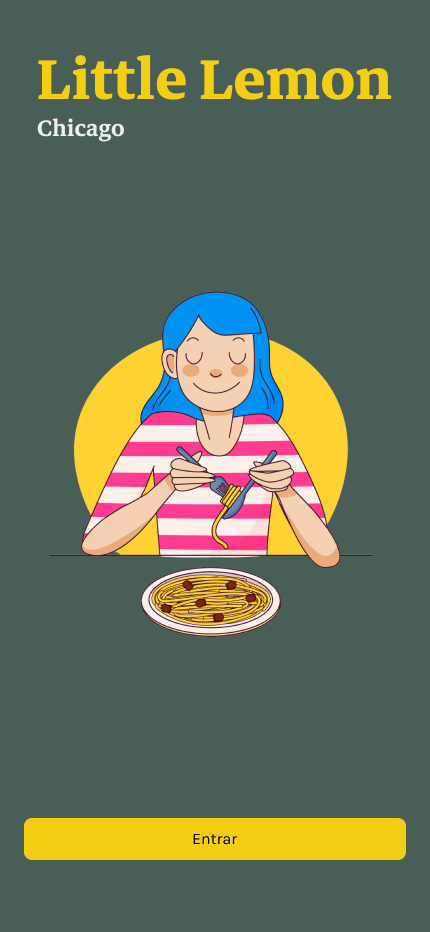
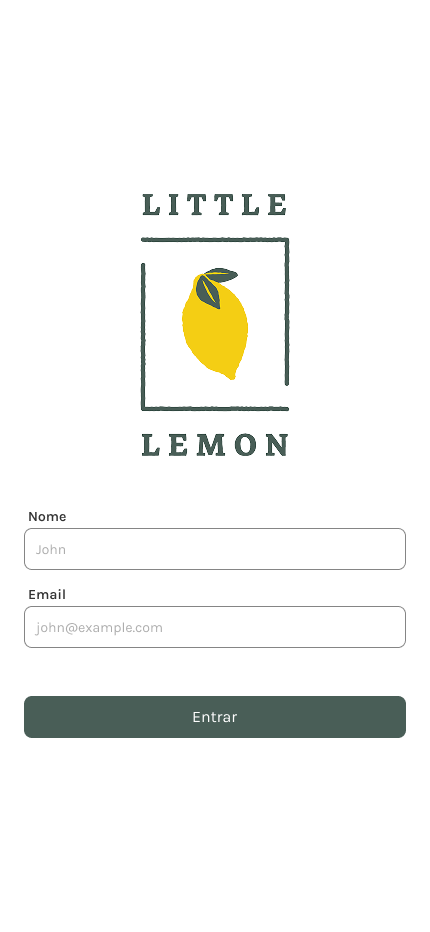
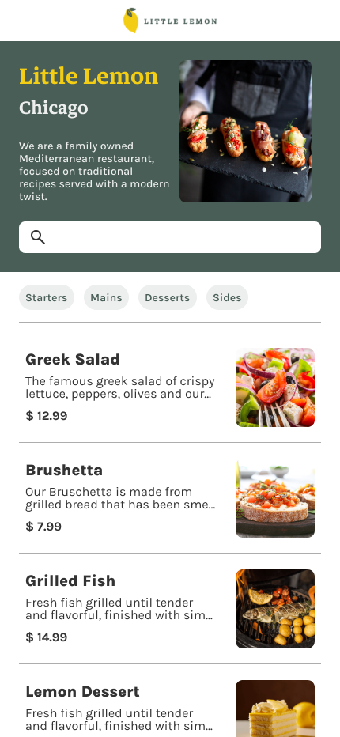
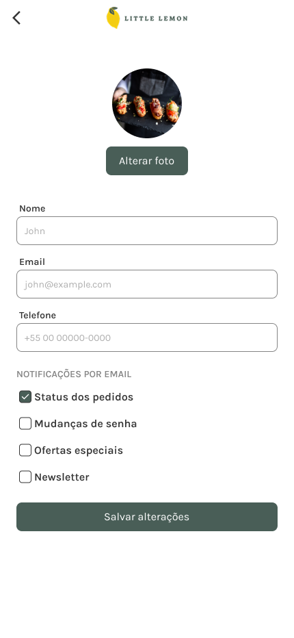

# 🍋 Little Lemon — React Native Capstone

Projeto final da especialização **React Native** da **Meta** no [Coursera](https://www.coursera.org/professional-certificates/meta-react-native-developer). O app é um cardápio digital para o restaurante fictício Little Lemon, um bistrô mediterrâneo familiar em Chicago.

---

## 📱 Telas

| Enter | Login | Menu | Perfil |
|:---:|:---:|:---:|:---:|
|  |  |  |  |

---

## ✨ Funcionalidades

- Tela de splash e onboarding
- Login com nome e e-mail
- Cardápio com busca e filtro por categoria
- Hero banner com identidade visual do restaurante
- Perfil com edição de dados e preferências de notificação
- Suporte a temas claro, escuro e premium
- Dados do menu consumidos via API e armazenados localmente com SQLite

---

## 🛠 Stack

| Tecnologia | Versão |
|---|---|
| Expo SDK | 54 |
| React Native | 0.81 |
| TypeScript | 5.9 |
| Expo Router | v4 (file-based routing) |
| React Native Unistyles | v3 (theming) |
| TanStack Query | v5 |
| SQLite (expo-sqlite) | — |
| React Native Keyboard Controller | — |
| Gesture Handler / Reanimated | — |

---

## 🚀 Como rodar

### Pré-requisitos

- [Node.js](https://nodejs.org/) 18+
- [Bun](https://bun.sh/) ou npm
- [Expo Go](https://expo.dev/go) no celular **ou** simulador iOS/Android

### Instalação

```bash
# Clone o repositório
git clone https://github.com/b1z3rr4/little-lemon.git
cd little-lemon

# Instale as dependências
bun install
```

### Rodando o projeto

```bash
# Iniciar Metro bundler
bun run start

# iOS
bun run ios

# Android
bun run android

# Web
bun run web
```

### Outros scripts

```bash
bun run lint      # Linting
bun run format    # Formatação com Prettier
bun run clean     # Limpar cache do Metro
```

---

## 🎓 Sobre o curso

Este projeto é o capstone da especialização [React Native da Meta](https://www.coursera.org/professional-certificates/meta-react-native-developer) no Coursera. O objetivo é consolidar os conhecimentos adquiridos ao longo da especialização construindo um app completo do zero — cobrindo navegação, consumo de API, persistência de dados, formulários e identidade visual.

---

Made with 🍋 by [B1z3rr4](https://github.com/b1z3rr4)
